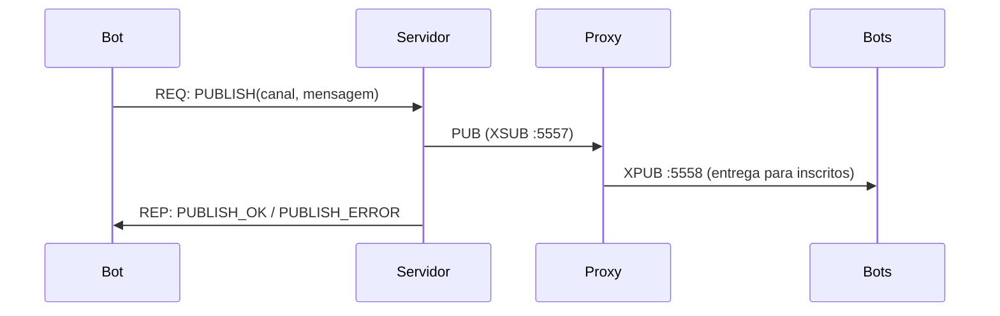

# BBS/IRC Messaging System — Sistemas Distribuídos

## Introdução

Este projeto implementa um sistema simplificado de troca de mensagens inspirado no **BBS (Bulletin Board System)** e no **IRC (Internet Relay Chat)**. O objetivo é demonstrar conceitos de sistemas distribuídos — comunicação entre processos, persistência de dados e orquestração de serviços — na prática.

Nesta **Parte 2**, o sistema já suporta tudo da Parte 1 mais:

- **Publicação em canais via Pub/Sub** com proxy XSUB/XPUB (`pubsub-proxy`)
- **Inscrição em canais** (cada bot se inscreve aleatoriamente em até 3 canais)
- **Bots padronizados em loop infinito** publicando 10 mensagens por canal a cada 1s
- **Persistência das mensagens** publicadas por servidor (`messages.json`)

Funcionalidades herdadas da Parte 1:

- Login de bots (clientes) nos servidores
- Listagem de canais disponíveis
- Criação de novos canais
- Persistência em disco: log de logins e lista de canais por servidor

---

## Grupo

Projeto em dupla — **2 integrantes** → 2 linguagens de programação.

| Integrante | Linguagem | Componentes |
|---|---|---|
| Gustavo Bertoluzzi Cardoso Ra:22.123.016-2 | **Python 3.12** | `python-server-1`, `python-server-2`, `python-bot-1`, `python-bot-2` |
| Isabella Vieira Silva Rosseto Ra:22.222.036-0 | **Java 21** | `java-server-1`, `java-server-2`, `java-bot-1`, `java-bot-2` |

Além disso, há **2 bots cruzados** para demonstrar interoperabilidade:

- `python-bot-cross-1` → conecta nos servidores Java
- `java-bot-cross-1` → conecta nos servidores Python

---

## Arquitetura

```
┌────────────────────────────────────────────────────────────────┐
│                       Docker Network: bbs-net                  │
│                                                                │
│  python-server-1 ◄── python-bot-1                             │
│  python-server-1 ◄── java-bot-cross-1   (cross-language)      │
│                                                                │
│  python-server-2 ◄── python-bot-2                             │
│  python-server-2 ◄── java-bot-cross-1   (cross-language)      │
│                                                                │
│  java-server-1   ◄── java-bot-1                               │
│  java-server-1   ◄── python-bot-cross-1 (cross-language)      │
│                                                                │
│  java-server-2   ◄── java-bot-2                               │
│  java-server-2   ◄── python-bot-cross-1 (cross-language)      │
└────────────────────────────────────────────────────────────────┘
```

Fluxo de mensagens por bot:

```
Bot → LOGIN       → Servidor responde LOGIN_OK / LOGIN_ERROR
Bot → LIST_CHANNELS → Servidor responde CHANNELS_LIST
Bot → CREATE_CHANNEL → Servidor responde CHANNEL_CREATED / CHANNEL_EXISTS / CHANNEL_ERROR
```

---

## Escolhas Técnicas

### Linguagens

- **Python 3.12** — linguagem do Gustavo. Excelente suporte a ZeroMQ (`pyzmq`) e MessagePack (`msgpack`).
- **Java 21** — linguagem da Isabella. Suporte a ZeroMQ via `jeromq` (pure Java) e MessagePack via `msgpack-core`.

### Serialização: MessagePack

Todos os dados trafegam em **binário usando [MessagePack](https://msgpack.org/)** — zero JSON, XML ou texto simples no wire.

| Critério | Escolha |
|---|---|
| Formato | MessagePack (binário, compacto) |
| Lib Python | `msgpack 1.1.0` |
| Lib Java | `msgpack-core 0.9.8` |

Todas as mensagens contêm obrigatoriamente:
- `type` — tipo da mensagem (ex.: `"LOGIN"`, `"LOGIN_OK"`)
- `timestamp` — Unix timestamp em ponto flutuante (`double`)

### Transporte: ZeroMQ REQ/REP **+ XSUB/XPUB Proxy** (Parte 2)

Dois padrões coexistem:

**1. REQ/REP — bot ↔ servidor (login, canais, publicação)**
- Servidor faz `bind` na porta `5555`
- Cliente faz `connect` e envia uma requisição por vez, aguardando resposta

**2. PUB/SUB através de proxy XSUB/XPUB — entrega das mensagens publicadas**
- Container `pubsub-proxy` faz `bind` em `XSUB :5557` e `XPUB :5558`
- **Servidores** abrem um socket `PUB` e fazem `connect` no `XSUB` (`tcp://pubsub-proxy:5557`). Quando recebem um `PUBLISH` de um bot, publicam a mensagem no canal (tópico).
- **Bots** abrem um socket `SUB` e fazem `connect` no `XPUB` (`tcp://pubsub-proxy:5558`), inscrevendo-se em até 3 tópicos aleatórios.
- Mensagens são enviadas em **multipart**: `[topic_bytes, msgpack_payload]`. Isso permite o filtro nativo do ZMQ por prefixo de tópico, com payload binário no segundo frame.
- O proxy desacopla totalmente publishers (servidores) de subscribers (bots): adicionar/remover servidores e bots não exige reconfiguração de ninguém.



### Comportamento padronizado dos bots (Parte 2)

Cada bot, ao iniciar, executa:

1. Login no servidor (com retry).
2. Lista os canais existentes; **se houver < 5, cria 1**.
3. Inscreve-se aleatoriamente em canais **até atingir 3 inscrições** (ou esgotar a lista).
4. Loop infinito: escolhe um canal aleatório e envia 10 mensagens com intervalo de 1s.

Em paralelo, uma thread `SUB` recebe e imprime na tela qualquer mensagem publicada nos canais inscritos, com:
- nome do canal,
- conteúdo da mensagem,
- `sent_ts` (timestamp do envio) e `recv_ts` (timestamp do recebimento).

### Persistência: JSON em disco

Cada servidor mantém **seu próprio conjunto de arquivos** no diretório `/data` (montado como volume Docker):

| Arquivo | Conteúdo |
|---|---|
| `logins.json` | Lista de todos os logins com `username`, `timestamp` e `server` |
| `channels.json` | Lista com os nomes dos canais criados |
| `messages.json` | (Parte 2) Lista de todas as publicações realizadas pelo servidor: `channel`, `message`, `from`, `timestamp`, `server` |

Os arquivos são escritos atomicamente (write-to-temp + rename) para evitar corrupção.

**Por que JSON?** Simples, sem dependência extra de banco de dados, legível para debug durante o desenvolvimento. O formato de troca de mensagens (wire) permanece binário (MessagePack).

---

## Como Executar

### Pré-requisitos

- Docker Desktop (ou Docker Engine + Compose v2)

### Subir todos os serviços

```bash
docker compose up --build
```

Isso irá:
1. Fazer build das imagens Python e Java
2. Subir o **`pubsub-proxy`** (XSUB :5557 / XPUB :5558)
3. Subir 4 servidores + 6 bots (4 nativos + 2 cruzados)
4. Exibir no terminal todos os envios/recebimentos REQ/REP **e** as publicações entregues por Pub/Sub

> **Aviso:** os bots da Parte 2 entram em **loop infinito** publicando mensagens. Para parar, use `Ctrl+C` no terminal e em seguida `docker compose down`.

### Rodar novamente (sem rebuild)

```bash
docker compose up
```

Os dados persistidos em `./data/` serão carregados, e os canais criados anteriormente aparecerão na listagem.

### Encerrar

```bash
docker compose down
```

Para apagar os dados persistidos também:

```bash
docker compose down -v
rm -rf ./data
```

---

## Estrutura do Projeto

```
SistemasDistribuidos/
├── README.md
├── docker-compose.yaml
├── data/                        ← criado automaticamente pelo Docker
│   ├── python-server-1/
│   │   ├── logins.json
│   │   └── channels.json
│   ├── python-server-2/
│   ├── java-server-1/
│   └── java-server-2/
├── python/
│   ├── Dockerfile
│   ├── requirements.txt
│   ├── server.py
│   ├── client.py
│   └── proxy.py             ← Pub/Sub XSUB/XPUB proxy (Parte 2)
└── java/
    ├── Dockerfile
    ├── pom.xml
    └── src/main/java/bbs/
        ├── Launcher.java
        ├── Protocol.java
        ├── Server.java
        └── Client.java
```

---

## Protocolo de Mensagens

### Tipos de Requisição (cliente → servidor)

| `type` | Campos extras | Descrição |
|---|---|---|
| `LOGIN` | `username: str` | Login do bot |
| `LIST_CHANNELS` | — | Listar canais |
| `CREATE_CHANNEL` | `channel_name: str` | Criar canal |
| `PUBLISH` | `channel_name: str`, `message: str`, `from: str` | (Parte 2) Pedir ao servidor para publicar no canal |

### Tipos de Resposta (servidor → cliente)

| `type` | Campos extras | Descrição |
|---|---|---|
| `LOGIN_OK` | `username: str` | Login aprovado |
| `LOGIN_ERROR` | `error: str` | Login rejeitado |
| `CHANNELS_LIST` | `channels: [str]` | Lista de canais |
| `CHANNEL_CREATED` | `channel_name: str` | Canal criado |
| `CHANNEL_EXISTS` | `channel_name: str` | Canal já existia |
| `CHANNEL_ERROR` | `error: str` | Nome inválido |
| `PUBLISH_OK` | `channel_name: str` | (Parte 2) Mensagem publicada com sucesso |
| `PUBLISH_ERROR` | `error: str` | (Parte 2) Falha na publicação (canal inexistente, vazio, etc.) |

### Mensagem entregue via Pub/Sub (servidor → bots inscritos)

Multipart `[topic, payload]` onde `payload` é MessagePack:

| Campo | Tipo | Descrição |
|---|---|---|
| `type` | `str` | Sempre `"CHANNEL_MSG"` |
| `timestamp` | `double` | Timestamp do envio pelo servidor |
| `channel` | `str` | Nome do canal |
| `message` | `str` | Conteúdo |
| `from` | `str` | Bot que originou o pedido |
| `server` | `str` | Servidor que publicou |

### Regras de Validação

- **Username / Channel name** devem seguir o padrão `[a-zA-Z0-9_-]` com no máximo 64 caracteres
- Username vazio → `LOGIN_ERROR`
- Channel name vazio ou com caracteres inválidos → `CHANNEL_ERROR`
- Canal duplicado → `CHANNEL_EXISTS` (não é erro fatal; o bot continua)
